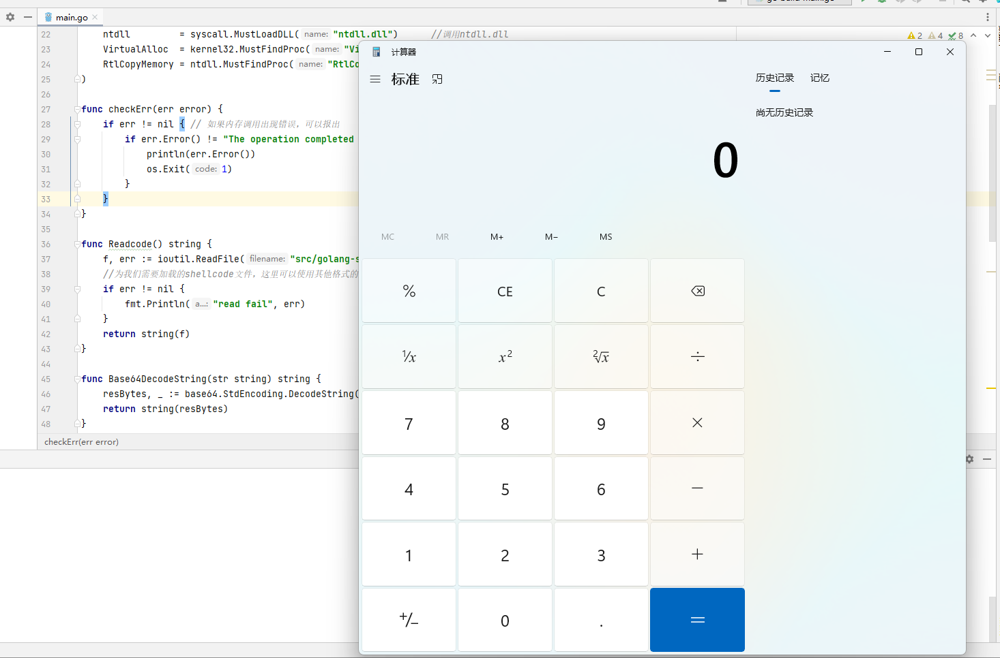

# Go-Shellcode-Bypass
> Golang实现的简单免杀

## 免杀思路

原理：1.延长运行时间，导致杀软检测超时，

​			2.利用杀软对golang的弱检测，

​			3.对shellcode进行多次编码解码来隐藏特征，

​			4.加载无关字符串混淆。

首先用msf或者cs生成shellcode，我这里是c语言格式的弹出计算器的shellcode，用于测试。


这里，需要转换一下格式，将\x替换为0x，中间用逗号隔开


最后会变成这样，其实到这里就可以用go来编译运行了，但尝试下来，这样的效果也不好。

后来修改了一下，把shellcode 单独拿出来，这里把`0x` 逗号 还有换行空格全部去掉，在加载时再恢复.


最后变成这样的16进制字符串，此时再进行免杀效果就很不错。

注意将这时的shellcode保存在txt文件，使用其他格式的文件来进行混淆。

编译 go程序，`go build main.go`

还可以做点手脚，比如去掉运行时的黑框 `go build -ldflags="-H windowsgui -w -s" main.go`
甚至可以让程序调用打开图片，让人以为这是一个打开图片的程序，放松警惕。

运行效果



此时VirusTotal查杀有11个杀软检测出来

再对shellcode进行多次base64编码，再次查杀后效果就好很多了。

我自己电脑上的火绒没有查出来，360也过了。


## 运行

#### 编译程序

```go
go build main.go
```

#### 去掉运行时的黑框 

```go
go build -ldflags="-H windowsgui -w -s" main.go
```

